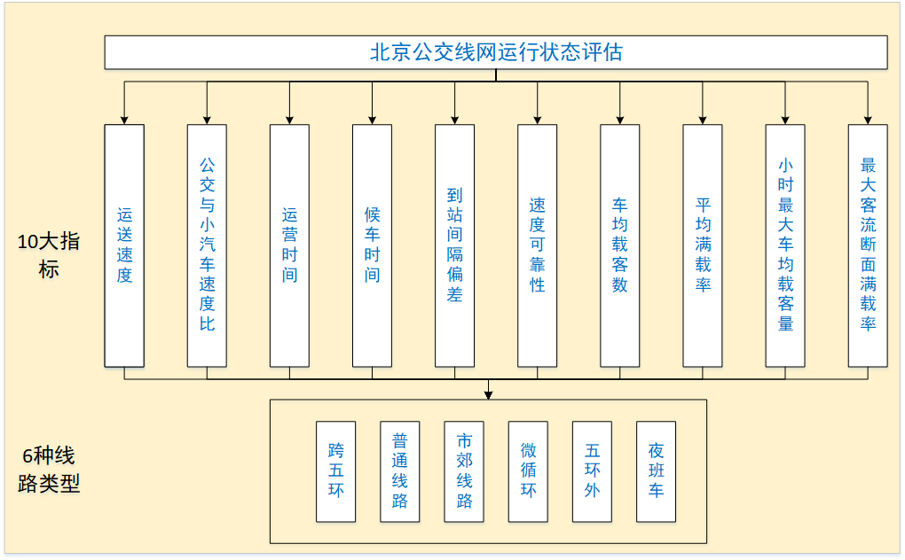
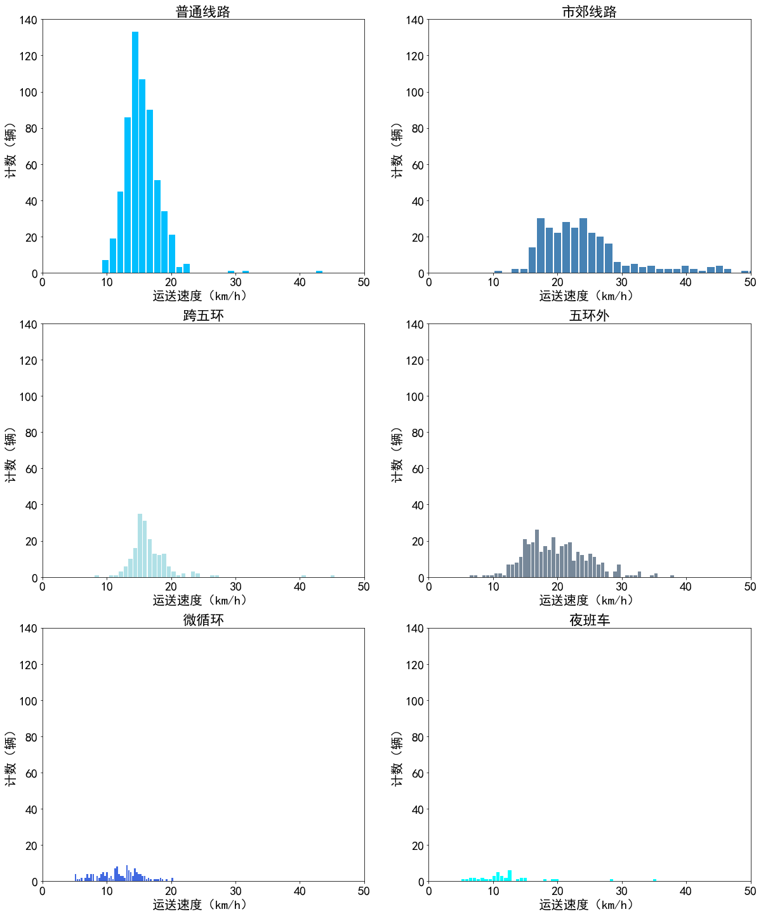
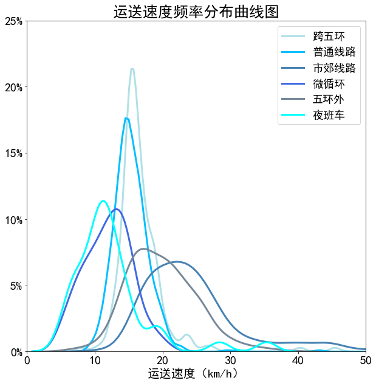

# Evaluation-of-public-transport-network-in-Beijing
## Evaluation-of-public-transport-network-in-Beijing
This project is a visual program for the analysis and evaluation of ten indicators of Beijing public transport network operation, which is divided into six types of lines.

本项目目的在于对北京公交线网运行情况进行评价分析，方法为对不同**线路指标**分**线路类型**进行频数分布图像以及频率分布曲线进行横向对比，得到同一指标，不同线路类型的数值特征以及交通规律。程序实现具体逻辑如下图所示：

# 结果分析
通过绘制不同线路类型的同一指标的频数分布直方图，可以直观清晰地看出不同线路类型的同一指标的横向差异，不难看出，普通线路的车辆是最多的。

通过频率分布曲线，可以看出不同线路类型的最大频数分布，以跨五环为例，其运送速度分布的最多的是18km/h左右。

